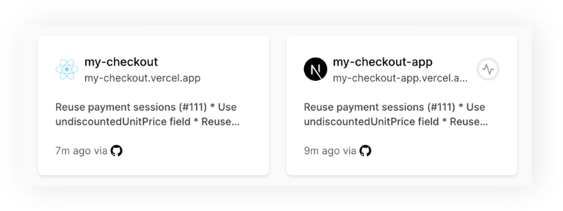
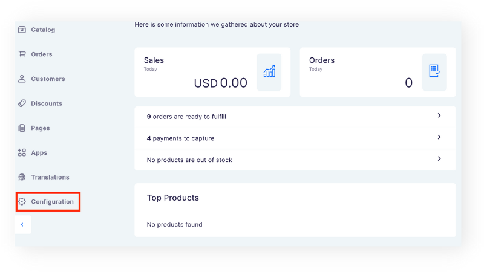
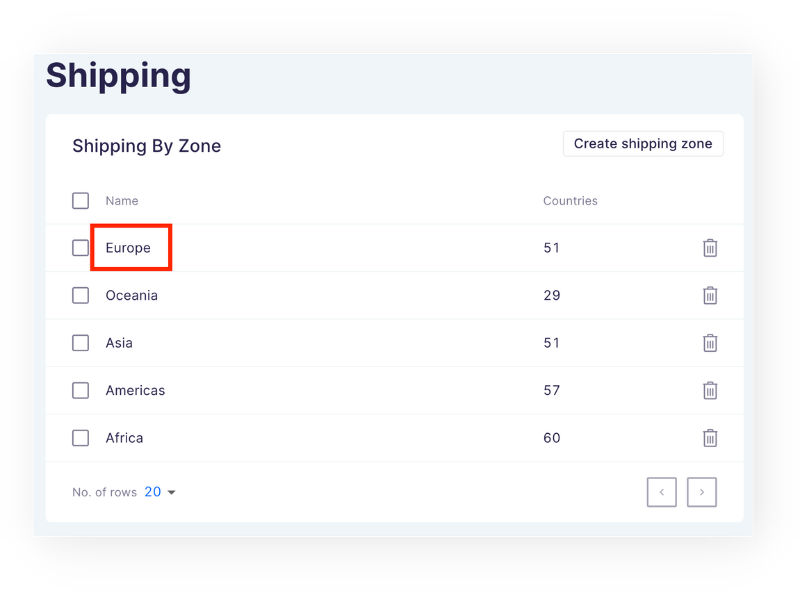
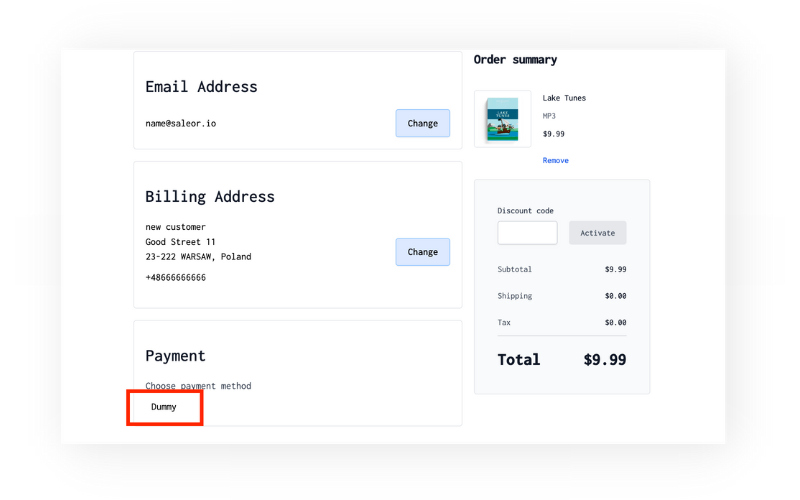
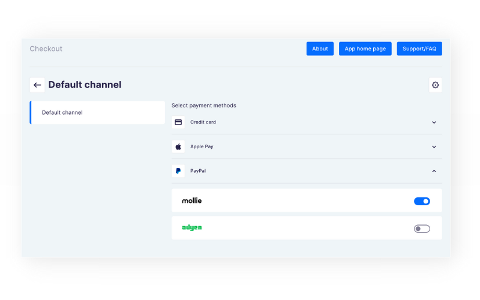
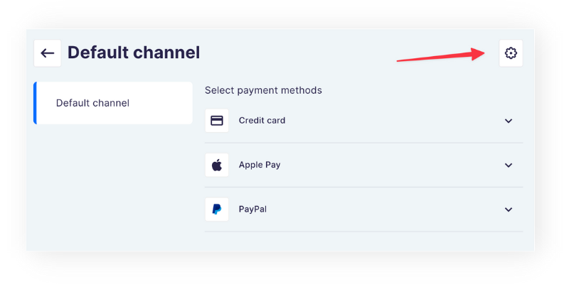
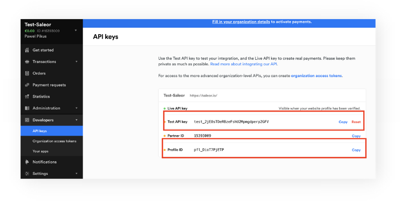
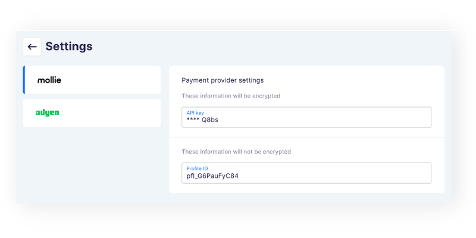
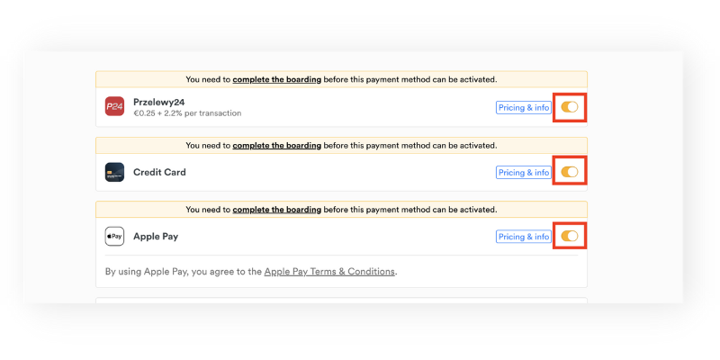

#

Saleor platform comprises many powerful parts that can be easily combined and integrated using CLI tool. This guide will show you how you can swiftly add Saleor checkout to an existing storefront.

## What will I learn?

After finishing this guide, you'll have accomplished the following:

1. Created a Saleor sample storefront.
2. Deployed Saleor Checkout SPA and Saleor Checkout App to Vercel.
3. Configure a custom payment gateway to be used with the Checkout App.

## Prerequisites

1. In order to be successful with adding the Checkout you need to integrate CLI with Vercel and Github.
   In your Terminal, run:

   ```
   saleor vercel login
   saleor github login
   ```

   You will be redirected to dedicated pages where you can finish the integration process.

2. If you wish to integrate the Checkout with a third-party payment gateway, Saleor enables that with two payment gateways: [Mollie](https://www.mollie.com/) and [Adyen](https://www.adyen.com/). Please follow their Getting Started pages and make sure to set up test accounts.

## Step 1. Creating Saleor Storefront.

You can integrate Saleor Checkout with any existing storefront. Yet, for the simplicity sake let us use a ready-made storefront example provided by Saleor.

1. Open your Terminal in the directory you want to install your storefront.
2. Run

`saleor storefront create my-storefront-with-checkout`

This command will install the Saleor Storefront project called `my-storefront-with-checkout` on your machine and start the local server.


For now, you can stop the server with `CTRL+C`.

## Step 2. Deploying Saleor Checkout SPA and Checkout App. Installing Checkout App in Dashboard.

Thanks to the CLI, the deployment process is very straightforward.

1. Being in your Terminal, type in:
   `saleor checkout deploy my-checkout`


After a while, you will have two apps deployed to Vercel:

- `my-checkout-app` - a Next.js Saleor App installed in Dashboard for managing settings and theme, backend for checkout SPA, ready to be extended/modified
- `my-checkout` - the frontend part - a SPA React 18 project, ready to be extended/modified
  

2. Copy the `url` of your Checkout App from Vercel to `.env` file in your storefront code.
   
   

Restart the develpment server.

## Step 4. Setting the shipping methods for Europe region.

You need to enable shipping methods for Europe region to be able to choose them in your checkout. So, go to your Dashboard and:

1. Click the Configuration button.
   
2. Scroll down to Shipping methods and click the card.
   
3. On the list of Shipping Zones click Europe.
   
4. In the right bottom corner, select Global from the Select Warehouse list.
   

Got to your storefront and try to go through the process of adding a product to cart. After clicking the Checkout button you'll be redirected to the checkout SPA view, where you can fill in the form and select the shipping methods.

## Step 3. Using the dummy payment gateway.

Saleor Checkout ships with a pre-built simple test payment gateway that will always return a successful payment.
Just type in any card number and other random payment details and click pay.



However, it is also possible to integrate Checkout with a third-party payment gateway, which you can do by following a guide in the next section.

## Step 4. Configuring a custom payment gateway.

For the purpose of this tutorial, we will focus on integration with Mollie.

1. Go to your Dashobard and inside the `Apps` click on the `Checkout App`.
2. Toggle, `Mollie` payment gateway for each payment option.
   
3. Click the `Settings` icon at the channel configuration page.
   
4. Provide the credentials obtained from your Mollie account.
   
   
5. Go to your Mollie Dashboard and in Settings -> Website Profiles -> Payment methods, toggle Payment methods.
   

Done! You can now test the functionality of the Mollie gateway in your Storefront's Checkout.
